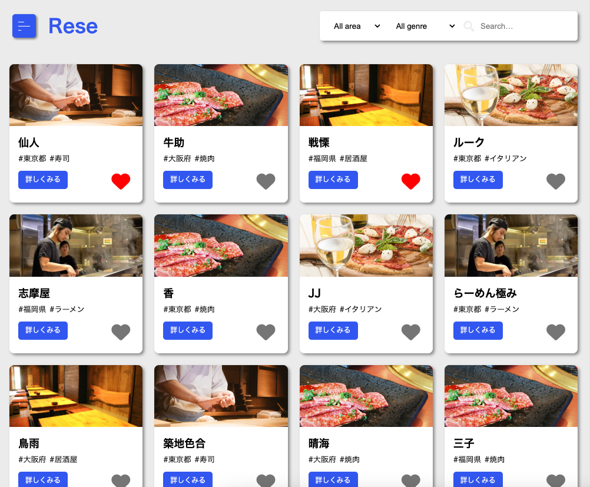
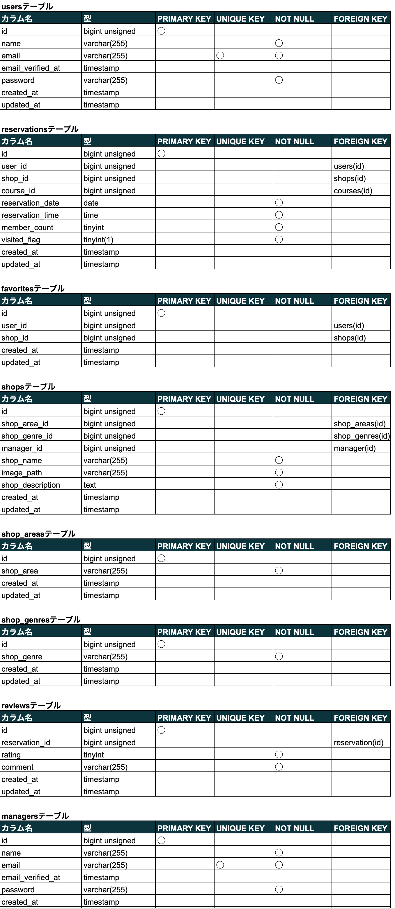
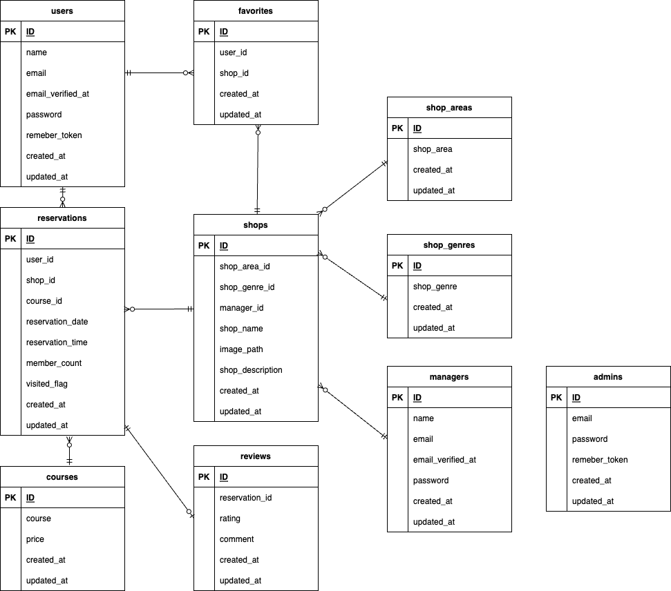

# Rese
ある企業のグループ会社の飲食店予約サービスです


## 作成した目的
外部の飲食店予約サービスでは手数料を取られるため、自社で予約サービスを持ちたい

## アプリケーションURL
### 開発環境
- ユーザー用ページ http://localhost/
- 店舗代表者用ページ http://localhost/manager/index
- 管理者用ページ http://localhost/admin/index

### 本番環境
- ユーザー用ページ http://
- 店舗代表者用ページ http://
- 管理者用ページ http://

確認用のアカウントを用意していますので、下記のアカウントを使用してログインしてください。  

## 他のリポジトリ
特になし

## 機能一覧
- 会員登録（メール認証を含む）
- ログイン・ログアウト
- 飲食店の一覧と詳細の表示、検索
- 飲食店の検索(エリア、ジャンル、店名)
- 飲食店の予約と決済
- 飲食店の予約内容変更とキャンセル
- 飲食店のお気に入り追加と削除
- 来店後の評価とコメントの追加、表示
- QRコードによる予約の照合と来店確認
- 利用者にお知らせメールを送信
- 予約当日の朝に予約情報のリマインダーを送信

## 使用技術（実行環境）
- PHP 8.1.27
- Laravel 9.52.16
- MySQL 8.0.26

## テーブル設計


## ER図


## 環境構築

 1. ```docker-compose up -d --build```
 2. ```docker-compose exec php bash```
 3. ```composer install```
 4. .env.exampleファイルから.envを作成し、環境変数を変更  
DB_CONNECTIONからDB_PASSWORD、MAIL_MAILERからMAIL_FROM_NAMEの項目を修正  
STRIPE_KEYとSTRIPE_SECRETの項目を追加
 5. ```php artisan key:generate```
 6. ```php artisan migrate```
 7. ```php artisan db:seed```
 8. ```php artisan storage:link```
 9. ```php artisan schedule:work```

## 補足事項
開発用の仮想SMTPサーバーとしてMailtrapの使用を想定しています。  
Mailtrapを使用する場合はサービスの登録と.envファイルの編集が必要です。

決済機能としてstripeを設定しています。  
使用する場合はサービスの登録と.envファイルの記述が必要です。

db:seedで確認用の仮データとして以下が挿入されます。
- ユーザーアカウント：user01~user03の3名分のユーザー
- メールアドレス：user01@example.com~user03@example.com（上記ユーザー名に対応したメールアドレス）
- 店舗代表者アカウント：manager01~manager10の10名分のユーザー
- メールアドレス：manager01@example.com~manager10@example.com（上記ユーザー名に対応したメールアドレス）
- 管理者アカウント：admin
- メールアドレス：admin@example.com
- パスワード（全アカウント共通）：coachtech
- その他店舗情報、予約情報、評価、お気に入り情報

schedule:workで予約情報のリマインダー送信機能が有効になります。
