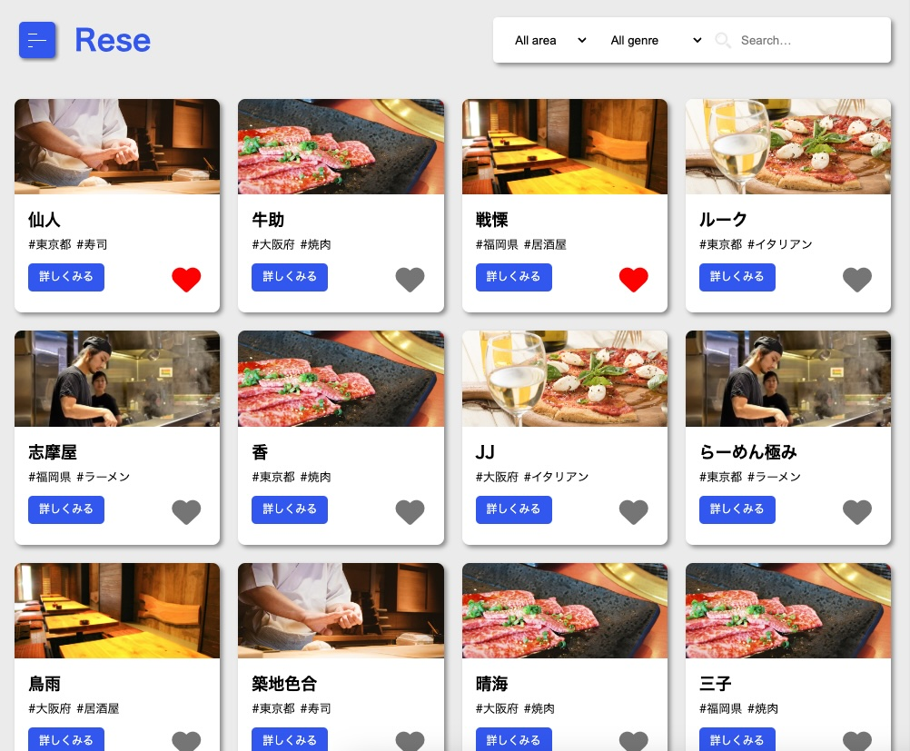
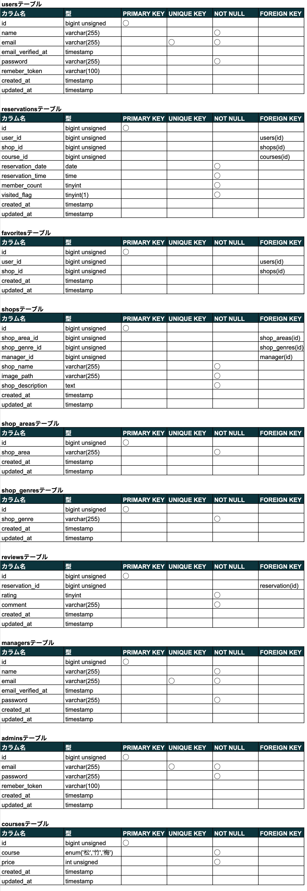

# Rese
ある企業のグループ会社の飲食店予約サービスです


## 作成した目的
外部の飲食店予約サービスでは手数料を取られるため、自社で予約サービスを持ちたい

## アプリケーションURL
### 開発環境
- ユーザー用ページ http://localhost/
- 店舗代表者用ページ http://localhost/manager/index
- 管理者用ページ http://localhost/admin/index

### ~~本番環境~~　※現在停止中です
- ~~ユーザー用ページ http://43.207.115.202/~~
- ~~店舗代表者用ページ http://43.207.115.202/manager/index~~
- ~~管理者用ページ http://43.207.115.202/admin/index~~

### 動作確認用のアカウント
確認用のアカウントを用意していますので、下記のアカウントを使用してログインしてください。  
アカウントはユーザー、店舗代表者、管理者の３種類です。  
- ユーザーアカウント：user01~user03の3名分のユーザー
- メールアドレス：user01@example.com~user03@example.com（上記ユーザー名に対応したメールアドレス）  
- 店舗代表者アカウント：manager01~manager10の10名分のユーザー
- メールアドレス：manager01@example.com~manager10@example.com（上記ユーザー名に対応したメールアドレス）  
- 管理者アカウント：admin
- メールアドレス：admin@example.com  
- パスワード（全アカウント共通）：coachtech

## 他のリポジトリ
該当なし

## 機能一覧
- 会員登録（メール認証を含む）
- ログイン・ログアウト
- 飲食店の一覧と詳細の表示
- 飲食店の検索(エリア、ジャンル、店名)
- 飲食店の予約と決済
- 飲食店の予約内容変更とキャンセル
- 飲食店のお気に入り追加と削除
- 来店後の評価とコメントの追加、表示
- QRコードによる予約の照合と来店確認
- 利用者にお知らせメールを送信
- 予約当日の朝7時に予約情報のリマインダーを送信
- 口コミの追加・編集・削除
- 店舗一覧ソート機能（ランダム・評価の高い順・評価の低い順）
- csvインポートによる店舗情報の追加（管理者のみ）

## 使用技術（実行環境）
- PHP 8.1.27
- Laravel 9.52.16
- MySQL 8.0.26

## テーブル設計


## ER図


## 環境構築

 1. ```docker-compose up -d --build```
 2. ```docker-compose exec php bash```
 3. ```composer install```
 4. .env.exampleファイルから.envを作成し、環境変数を変更  
DB_CONNECTIONからDB_PASSWORD、MAIL_MAILERからMAIL_FROM_NAMEの項目を修正  
STRIPE_KEYとSTRIPE_SECRETの項目を追加
 5. ```php artisan key:generate```
 6. ```php artisan migrate```
 7. ```php artisan db:seed```
アカウント情報、店舗情報、予約情報、評価、お気に入り情報が挿入されます
 8. ```php artisan storage:link```
 9. ```php artisan schedule:work```
 予約情報のリマインダー送信機能が有効になります

## 補足事項
### 開発環境の構築について
仮想SMTPサーバーとしてMailtrapの使用を想定しています。  
Mailtrapを使用する場合はサービスの登録と.envファイルの編集が必要です。

決済機能としてstripeを設定しています。  
使用にはサービスの登録と.envファイルの記述が必要です。

### csvファイルの記述方法
管理者のアカウントでログインし、メニュー→Importページ内でcsvインポートによる店舗情報を追加することができます。
csvファイルを作成する場合は１つのレコードにつき1行で、カンマ区切りで入力してください。入力項目と各項目の入力方法は以下の通りです。

1行目に以下の項目名を入力し、2行目から追加する店舗情報を入力してください。
- shop_area_id,shop_genre_id,manager_id,shop_name,image_path,shop_description

1. shop_area_id　地域：1~3の値 「東京都」「大阪府」「福岡県」のいずれか
1. shop_genre_id　ジャンル：1~5の値　「寿司」「焼肉」「イタリアン」「居酒屋」「ラーメン」のいずれか
1. manager_id　店舗代表者ID：1~10の値　店舗代表者ユーザー10名のいずれか
1. shop_name　店舗名：50文字以内の文字列
1. image_path　画像URL：jpeg、pngの画像URL
1. shop_description　店舗概要：400文字以内の文字列

なお、srcディレクトリ直下にテストファイルを用意しています。
- インポート確認用（import.csv） ダミーの店舗を追加します
- バリデーション確認用（import-error.csv）　インポートエラーとなり、バリデーションメッセージが表示されます

### 口コミの追加について
一般ユーザーのアカウントでログインし、メニュー→mypage→来店履歴の項目から口コミを追加することができます。なお、予約・来店済みの場合に1件だけ口コミの追加することができます。

